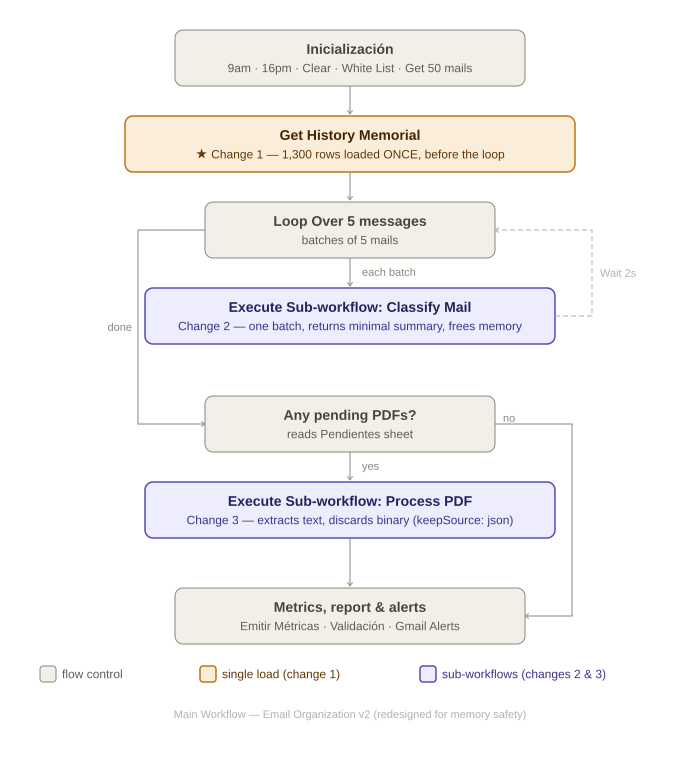
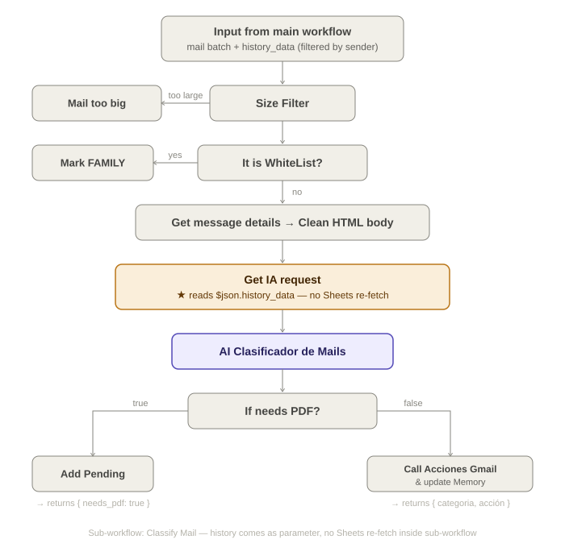

# n8n Cloud — Email Classification Workflow: Memory OOM Diagnosis & Redesign

> **Context:** Personal AI-powered email triage system built on n8n Cloud, OpenAI GPT-4o-mini, Gmail API, and Google Sheets. This document covers a production memory failure, its root-cause analysis, and the architectural redesign that resolved it.

---

## Overview

I run a Gmail classification workflow on **n8n Cloud (Starter plan, ~320 MiB RAM)** that processes 25 emails twice a day, labels them using an AI agent, logs decisions to Google Sheets, and sends a daily summary report. The workflow handled most runs fine — until emails with PDF attachments were involved. With 2–3 PDFs in a batch, the workflow would crash mid-execution with near-instant errors ("Error in 42ms"), no consistent node, and no useful stack trace.

The investigation that followed went deep into n8n Cloud's memory model, the behavior of `SplitInBatches` with cross-node references, binary data handling, and the `Wait` node's serialization threshold. The full technical research is documented in [`n8n-cloud-technical-reference.md`](./n8n-cloud-technical-reference.md)

---

## The Problem

### Symptoms

- Workflow crashes on random nodes, only when PDF attachments are present (2–3 per 25-email batch)
- Error duration: 42ms or less — meaning the failure is synchronous, not a network timeout
- The n8n Cloud instance shows as "offline" for a few seconds, then recovers
- Runs with no PDFs complete successfully
- The problem worsens over time within a single execution (later batches fail more often than early ones)

### Root Cause Analysis

Three concurrent memory multipliers were identified:

#### 1. `Get History Memorial` fetched inside every loop iteration

The Google Sheets node that loads ~1,300 rows of email history was placed **inside** the `Loop Over 5 messages` (`SplitInBatches`) node body. n8n's execution model retains the output of every node for the entire duration of an execution — including across loop iterations. This means:

- Iteration 1: 1,300 rows loaded → stored in execution memory as `run[0]`
- Iteration 2: 1,300 rows loaded again → stored as `run[1]` (previous data NOT purged)
- Iteration N: N × 1,300 rows in RAM simultaneously

With 25 emails in batches of 5, this produces **5 re-fetches** of 1,300 rows, all accumulating in memory.

#### 2. Gmail `downloadAttachments: true` + binary data in Cloud

Each PDF attachment goes through the following lifecycle:
1. Gmail API returns it base64-encoded (~667 KB for a 500 KB PDF)
2. n8n decodes it into a `Buffer` and stores it in the execution item as a binary field
3. **On n8n Cloud**, binary data is always stored in RAM — `filesystem` and `S3` modes are self-hosted / Enterprise only
4. The `Wait` node (2s) is below the 65-second serialization threshold, so the execution **stays in memory** rather than being written to the database

Estimated RAM per attachment: ~1.1–1.5 MB, multiplied by the number of concurrent items in the loop accumulation.

#### 3. `SplitInBatches` accumulates across all iterations

n8n's `SplitInBatches` (Loop Over Items) holds:
- The **full original input array** in memory (to know which items remain)
- The **combined output of all processed batches** (to emit them on the `done` branch)

There is no purge between iterations. Adding binary attachments, re-fetched Sheets data, and AI response payloads to this accumulation makes it grow linearly with batch count.

**Effective RAM pressure at crash point (Starter plan, 320 MiB, ~180 MiB used by n8n itself):**

| Source | Estimated size |
|---|---|
| n8n base process | ~180 MiB |
| 5× Get History Memorial (1,300 rows each) | ~40–60 MiB |
| 3× PDF attachments (Buffer + base64 transient) | ~4–5 MiB |
| All other execution data (Gmail metadata, AI responses, counters) | ~20–30 MiB |
| **Total** | **~244–275 MiB → OOM on 320 MiB limit** |

---

## Solution: Architectural Redesign

The fix is **structural, not configurational**. Three changes address each root cause independently.

### Change 1 — Load `Get History Memorial` once, before the loop

The Sheets node is moved outside `SplitInBatches`. The data is then distributed to each mail item before the loop starts:

1. **Aggregated** into a single item (`{history: [...]}`)
2. **Merged** with the aggregated mail items (`{mails: [...]}`)
3. **Distributed** — a `Code` node (`Code: Preparar history por remitente`) filters history by sender and injects only the relevant rows as `history_data` into each mail item. The same node also injects `isWhitelisted` per item, so the whitelist check inside the sub-workflow doesn't require a Sheets call either.

This means 1,300 rows are loaded **once**, filtered **once per sender**, and carried as a small JSON field per item rather than being re-fetched on every iteration.

> **Implementation note:** The sender field from the Gmail API arrives as `"Display Name <email@domain.com>"`. The distribution code extracts the email address with a regex before matching against the history map (`historyMap[extractEmail(mail.From)]`).

### Change 2 — Main loop calls a sub-workflow per mail

The entire inner loop body is extracted into a separate n8n workflow (`Sub - Classify Mail (v2)`). The main workflow calls it via `Execute Workflow` in **"Run once for each item"** mode — one sub-workflow execution per mail, not per batch.

Key properties:
- Each sub-workflow execution receives one mail item (with `history_data` and `isWhitelisted` already injected)
- When the sub-workflow finishes, its execution memory is freed before the next mail is processed
- The main loop accumulates only the small return summaries, not the full Gmail payloads
- `Wait 2s` (below 65s threshold, so still in-memory) now holds only the compact result

The sub-workflow has **independent return paths per branch** — no final merge node. Each branch (too big, whitelisted, classified, pending PDF) ends in its own `Return` Code node that emits the same minimal structure `{ id, from, subject, categoria, confianza, needs_pdf, accion_tomada }`. This avoids the problem of a merge node receiving `{ status: "ok" }` from a sub-workflow call instead of the original mail data.

`Contar Mail Procesado` lives in the **main workflow** (after the `Execute Workflow` node returns), not inside the sub-workflow. This is required because `$getWorkflowStaticData('global')` is scoped per workflow — a sub-workflow cannot write to the parent's static data.

### Change 3 — PDF processing sub-workflow with `keepSource: json`

The pending PDF loop (`Loop 3 pending`) calls a dedicated sub-workflow (`Sub - Process PDF (v2)`). Inside it:
- Gmail fetches the attachment with `downloadAttachments: true`
- An **attachment type filter** (IF node on mime type) prevents the workflow from attempting PDF extraction on non-PDF attachments (`.ics`, `.docx`, etc.) — a real production case that caused crashes
- `Extract from File` runs with `keepSource: json` — this **discards the binary** from the output item immediately after text extraction
- The binary never accumulates because the sub-workflow completes and releases memory before the next item

`Contar Mail Procesado` is also placed in the main workflow after the PDF sub-workflow returns, for the same `staticData` scoping reason.

---

## Architecture Diagrams

### Redesigned Main Workflow

27 nodes (down from 48 in the original). All heavy processing delegated to sub-workflows.



**Color coding:**
- Gray — flow control (triggers, loops, Sheets reads, metrics)
- **Amber** — single-load data node (Change 1: history loaded once)
- **Purple** — sub-workflow calls (Changes 2 & 3: memory isolated per batch)

---

### Sub-workflow: Classify Mail

Receives one mail item pre-loaded with `history_data` and `isWhitelisted`. The `Get IA request` node reads `$json.history_data` directly — no Sheets call inside the sub-workflow.



Each branch ends in an independent `Return` node. No merge at the end.

---

## Key Changes Summary

| # | What changed | Why |
|---|---|---|
| 1 | `Get History Memorial` moved before the loop | Eliminates N × 1,300-row accumulation in execution memory |
| 2 | Inner loop body → `Execute Workflow: Classify Mail` (one per mail) | Sub-workflow memory freed after each mail; only small summary returned |
| 3 | PDF loop body → `Execute Workflow: Process PDF` with `keepSource: json` | Binary attachment released immediately after text extraction |
| 4 | Two schedule triggers (9am + 4pm) replacing single 7am trigger | Splits 50-email daily load into two 25-email runs for lower peak memory |
| 5 | `history_data` + `isWhitelisted` injected per mail item before the loop | Passes only relevant data to sub-workflow; no Sheets calls inside loops |
| 6 | Independent return paths per branch (no final merge) | Avoids losing mail data when sub-workflow calls return `{ status: ok }` |
| 7 | Attachment mime type filter in PDF sub-workflow | Prevents crash on non-PDF attachments (`.ics`, calendar invites, etc.) |
| 8 | `Contar Mail Procesado` in main workflow, not sub-workflows | `$getWorkflowStaticData` is scoped per workflow — sub-workflows cannot write to parent counters |

---

## Node Count Before / After

| | Original | Redesigned main workflow |
|---|---|---|
| Total nodes | 48 | 27 |
| Nodes inside main loop body | ~18 | 1 (Execute Workflow) |
| Google Sheets calls per 25-mail run | 5–6 (history re-fetched each iteration) | 1 (history loaded once) |
| Binary data in main workflow RAM | Yes (full PDF buffers) | No (handled and freed in sub-workflow) |

---

## Files in This Repository

```
├── README.md                          ← this document
├── n8n-cloud-technical-reference.md   ← full technical research: memory limits,
│                                         SplitInBatches behavior, Wait node threshold,
│                                         binary data handling, Google Sheets in loops
└── diagrams/
    ├── main-workflow.svg              ← redesigned main workflow architecture
    └── sub-workflow.svg              ← sub-workflow: Classify Mail internals
```

---

## Technical References

- [n8n Memory and Performance documentation](https://docs.n8n.io/hosting/scaling/memory-errors/)
- [n8n SplitInBatches node reference](https://docs.n8n.io/integrations/builtin/core-nodes/n8n-nodes-base.splitinbatches/)
- [n8n Execute Workflow node reference](https://docs.n8n.io/integrations/builtin/core-nodes/n8n-nodes-base.executeworkflow/)
- `n8n-cloud-technical-reference.md` — custom research document covering: RAM limits by plan, Wait node serialization threshold (65s), binary data in Cloud, SplitInBatches memory accumulation, `keepSource` on Extract from File, Gmail `downloadAttachments` payload size, "Error in 42ms" diagnostic

---

## Stack

`n8n Cloud` · `OpenAI GPT-4o-mini` · `Gmail API` · `Google Sheets API` · `JavaScript (n8n Code nodes)`
